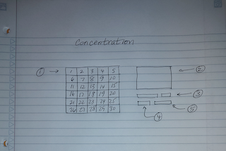

# Classic Concentration

A take back to the concentration game show that players need to guess matching pairs 
of objects and, at the end of the game, guess a rebus puzzle. 

## Technologies Used

- HTML
- CSS (w z-index library)
- Javascript

## Getting Started

### Screen Layout 



1. Board - The board is made up of a 5x6 grid. When the game is first started the user sees the number ranging from 1 to 30 on eqch sqare.

2. Text Box - Used to give the player instructions on how to play the game.

3. Input/Submit Rebus Puzzle Answer - used to allow player to submit an answer to the rebus puzzle.

4. Play Button - Used to start the game (clear the instructions and enable event listending)

5. Number of Guesses Taley - Player will see how many guesses they've used (out of a maxiumum of 30).

### Rules of the Games

1. Game consists of a single player.

2. A player's turn includes clicking the mouse over two squares to reveal an emoji hiding underneath. If the player finds a matching set of emojies, the squares will reveal a part of the rebus puzzle underneath. If the player does not find a matching set of emojies, the number of the square is put back.

3. Player must find all 15 matching pairs of emojis within 30 guesses to win the game.

4. Regardless of whether the player finds all 15 matching emoji pairs or not, the user can guess the answer to the rebus puzzle.

### Possible Additions

  - Using CSS/JS, create the effect that each square is a 3-sided box that can turn 120 degress to display the three layers:
      - the top layer (the number of the square)
      - the middle layer (the emoji image)
      - the bottom layer (the part of the rebus puzzle).

  - Try to find Concentraton theme song to play as the game is loaded up.

  - Play applause sound when player finds a matching pair of emojis

  - Play a "ah" sound when player does not find a matching paiar of emojis.

  - Play theme song and applause when player wins.

  - Create a sound button with a speaker icon to turn on/off sound

### Constants

```
   EMOJI = { // partial list
     "img" : "",                 ,                  // 0
     "img" : "img/emoji/ambulance.png",             // 1
     "img" : "img/emoji/art.png",                   // 2
     "img" : "img/emoji/bell.png",                  // 3
     "img" : "img/emoji/boom.png",                  // 4
     "img" : "img/emoji/cake.png",                  // 5
     "img" : "img/emoji/camel.png",                 // 6
     "img" : "img/emoji/church.png",                // 7
     "img" : "img/emoji/dog2.png",                  // 8 
     "img" : "img/emoji/duck.png",                  // 9 
   }

   REBUS_PUZZLE = { // partial list
      "img" : "",                  "solution" : "",  "phoneticSolution" : ""   // 0
      "img" : "img/puzzle1.png",   "solution" : "",  "phoneticSolution" : ""   // 1
      "img" : "img/puzzle2.png",   "solution" : "",  "phoneticSolution" : ""   // 2
      "img" : "img/puzzle3.png",   "solution" : "",  "phoneticSolution" : ""   // 3
      "img" : "img/puzzle4.png",   "solution" : "",  "phoneticSolution" : ""   // 4
   };

   MAX_GUESSES 30
```

### State Variables

- board             - 5x6 array - each square has a z-index value of what should 
                    be displayed ( 0, 1, 2 ). 0 = number, 1 = emoji, 2 = rebus
- emojiBoard        - 5x6 array - each square holds an emoji index
- numGuesses        - player is allowed 30 guesses total
- squareSelected[2] -  player is allowed to select two squares per turn (stores 
                     what "id" is selected).
- rebusNum          - stores which puzzle num should be displayed


### Cached DOM Elements
- *titleEl* (Concentration)
- *boardEl* (5x6 grid)
- *statusBoxEl* (display directions (in index.html) and gives feedback)
- *rebusAnswerBoxEl* (input guess)
- *rebusSubmitBoxEl* (submit guess)
- *playButtonEl* (play/restart game)
- *numGuessesBoxEl* (displays how many guesses used)

### Pseudocode

#### Init

1. Initialize Variables
   *numGuessses* = -1

2. When *numGuesses* is -1:
   - *rebusNum* = (randomly select one of the puzzles)
   ```
   SquaresSelected[2] = { 0, 0};
   board = { // board should display number
     { 0, 0, 0, 0, 0},
     { 0, 0, 0, 0, 0},
     { 0, 0, 0, 0, 0},
     { 0, 0, 0, 0, 0},
     { 0, 0, 0, 0, 0},
     { 0, 0, 0, 0, 0}
   }
    emojiBoard = { // no emoji assigned yet
     { 0, 0, 0, 0, 0},
     { 0, 0, 0, 0, 0},
     { 0, 0, 0, 0, 0},
     { 0, 0, 0, 0, 0},
     { 0, 0, 0, 0, 0},
     { 0, 0, 0, 0, 0} 
     ```
   - *boardEl* eventlister ignores click event 
   - *statusBox*El "To start: press 'Start Game' button" is appended to the .innerText.
   - *rebusAnswerBoxEl* - hidden
   - *rebusSubmitBoxEl* - hidden
   - *playButtonEl* - shows "Start Game"
   - *numGuessesBoxEl* - hidden

#### Start Game
1. When Player Clicks "Start Game"
   - *emojiBoard* gets randomly populated with 15 pairs of emoji indices
   - *numGuesses* = 0
   - *squareSelected[0].id* = 0
   - *squareSelected[1].id* = 0
   - *boardEl* eventlister listens for click event 
   - *rebusAnswerBoxEl* - hidden
   - *rebusSubmitBoxEl* - hidden
   - *playButtonEl* - hidden
   - *numGuessesBox* - shows "Number of Guesses " + *numGuesses* + " of " +  *MAX_GUESSES*;

2. When Player Clicks a Sqaure
   - If *SquaresSelected[0]* === 0 , statusBox shows "Select first square"
   - If *SquaresSelected[0]* *!== 0 , statusBox shows "Select second square"
   - If *SquaresSelected[1]* *!== 0 , figuer out if *SquareSelected[0]* === *SquareSelected[1]*.
        - If they match - *statusBoxEl* shows "Correct!" in Green
        - If they do not match - *statusBoxEl* shows "Wrong!" in Red
        - Increment *numGuesses*
             - Is *numGuesses* === *MAX_GUESSES*
                  - *boardEl* eventlister ignores click event 
                  - all elements of *board* array should get set to '2' to display the rebus puzzle
                  - *StatusBoxEl* shows "I'm sorry, you did not win. Try to guess the answer to the Rebus Puzzle" in Black
                  - *rebusAnswerBoxEl* - display
                  - *rebusSubmitBoxEl* - display
                  - *numGuessesBoxEl* - hidden
                  - *playButtonEl* - hidden

3. When the *rebusSubmitBoxEl* is clicked
   - Retrieves the player's answer in *rebusAnswerBoxEl*
   - Is the player's answer === *REBUS_PUZZLE[rebusNum].solution* ?
      - If yes, *statusBoxEl* shows "You're Right!"
      - If no,  *statusBoxEl* shows "Ahh, sorry. <players answer> is not correct. Good Guess!";
   - *rebusAnswerBoxEl* - hidden
   - *rebusSubmitBoxEl* - hidden
   - *numGuessesBoxEl* - hidden
   - *playButtonEl* - shows "New Game"
