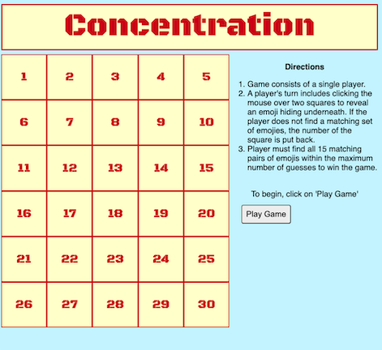
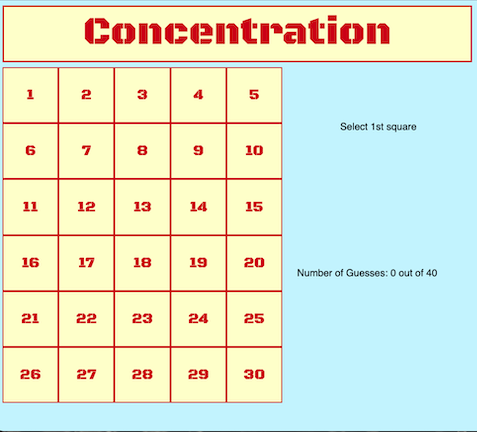
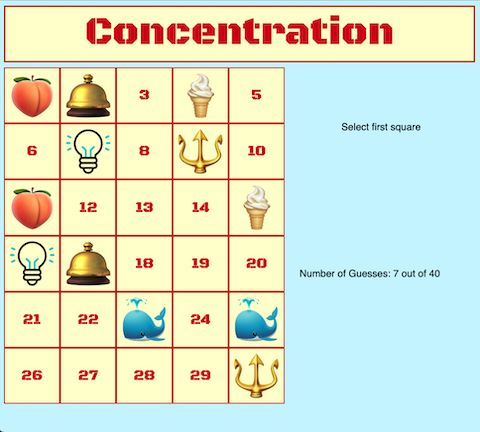
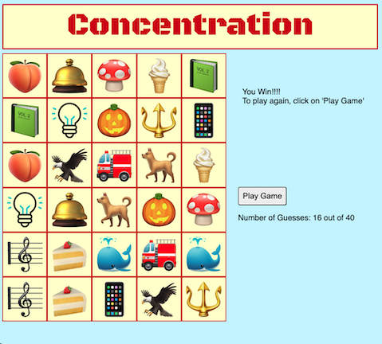

# CONCENTRATION

## Rules

1. Game consists of a single player.
2. A player's turn includes clicking the mouse over two squares to reveal an emoji hiding underneath. If the player does not find a matching set of emojies, the number of the square is put back.
3. Player must find all 15 matching pairs of emojis within the maximum number of guesses to win the game.

Go [here](https://bobpac.github.io/Project1/) to get to the game of Concentration! Have fun!!!

## Technical Requirements

- HTML
- CSS
- Javascript

## Screen Shots

### Directions
Initial screen on loading the game.

### Starting a Game
After pressing the "Play Game" button, select two numbered squares. Try to remember where each image is hiding since you only have 40 turns.

### Playing a Game
As you progress in the game, you'll gradually accumulate pairs of images making the game easier and easier.

### Winning the Game
If you uncover all 15 pairs of emoji's, you win! But if you at first don't succeed, try, try, again.

